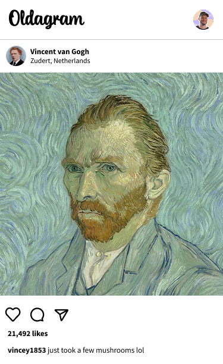

# 📸 Oldagram  

Oldagram is a fun, Instagram-style project built with **HTML and CSS**. It mimics a classic Instagram feed but with **historic paintings and artists as influencers**.

## ✨ Preview 

  

## 🔗 Links
[View Oldagram](https://aditi-jadhav-arch.github.io/oldagram/)
